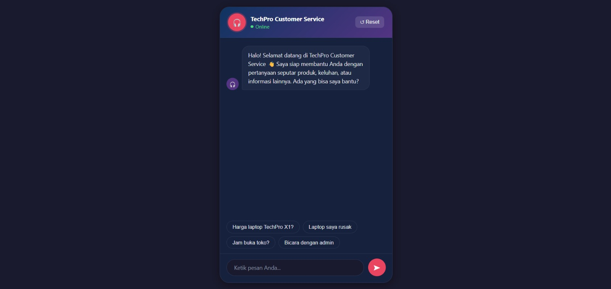
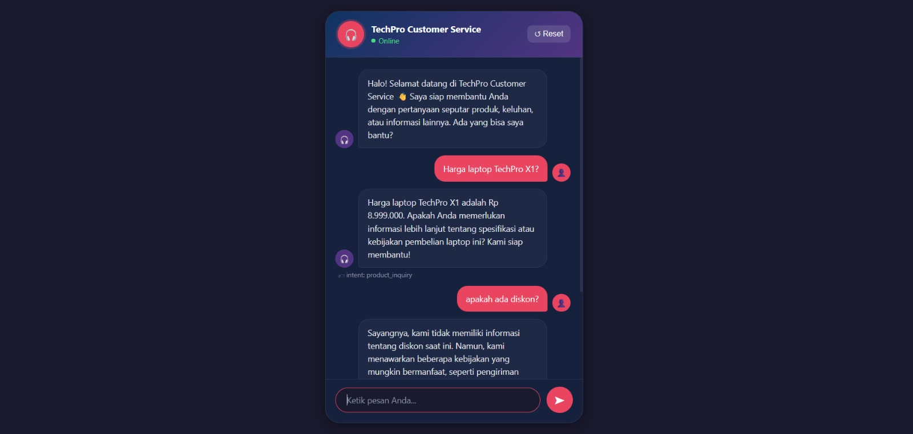
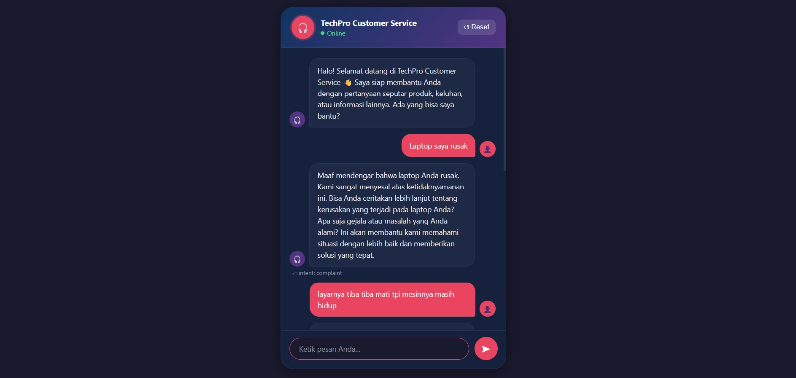
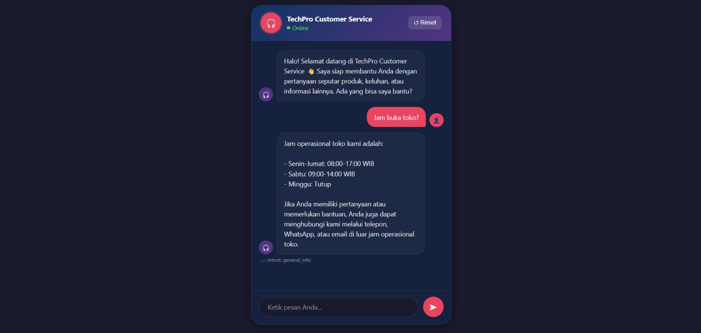
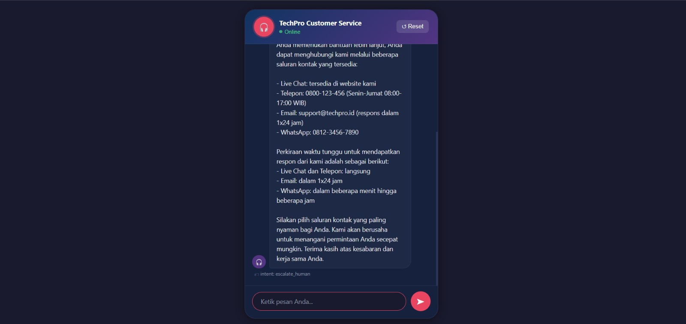

# 🤖 Customer Service Chatbot
### Sistem Chatbot Berbasis NLP/LLM dengan LangChain + LangGraph + LangSmith

[](https://python.org)
[](https://fastapi.tiangolo.com)
[](https://langchain.com)
[](https://langchain-ai.github.io/langgraph)
[](https://smith.langchain.com)
[](https://console.groq.com)

---


---

## 📸 Screenshot

### Tampilan Chat UI


### Contoh Percakapan — Product Inquiry


### Contoh Percakapan — Complaint


### Contoh Percakapan — General Info


### Contoh Percakapan — Escalate Human



---

## 📋 Deskripsi Proyek

**Customer Service Chatbot** adalah sistem percakapan cerdas yang dibangun untuk menangani berbagai kebutuhan pelanggan secara otomatis. Sistem ini mampu mengklasifikasikan intent pengguna, memberikan respons yang tepat berdasarkan knowledge base, dan mengalihkan ke agen manusia jika diperlukan.

### Fitur Utama
- 🎯 **Intent Classification** — Otomatis mendeteksi maksud pengguna
- 🛍️ **Product Inquiry** — Menjawab pertanyaan seputar produk, harga, dan spesifikasi
- 😤 **Complaint Handling** — Menangani keluhan dengan empati dan solusi konkret
- 📋 **General Info** — Informasi jam operasional, kebijakan, dan prosedur
- 👨‍💼 **Human Escalation** — Eskalasi otomatis ke agen manusia untuk kasus kompleks
- 📊 **Tracing & Monitoring** — Pemantauan real-time dengan LangSmith
- 💬 **Chat UI** — Frontend siap pakai (buka `http://localhost:8000`)

---

## 🛠️ Tech Stack

| Library | Versi | Fungsi |
|---------|-------|--------|
| **LangChain** | 0.3.0 | Chains untuk LLM, prompt management, output parsing |
| **LangGraph** | 0.2.28 | State machine & workflow orchestration |
| **LangSmith** | 0.1.125 | Tracing, monitoring, evaluasi performa |
| **FastAPI** | 0.115 | REST API framework |
| **Groq** | llama-3.3-70b | LLM — gratis & sangat cepat |

---

## 🏗️ Arsitektur Sistem

```
┌──────────────────────────────────────────────────┐
│            CLIENT (Browser / HTTP)                │
└─────────────────────┬────────────────────────────┘
                      │ POST /chat  |  GET /
                      ▼
┌──────────────────────────────────────────────────┐
│             FASTAPI (main.py)                     │
│     Validasi Request → Invoke LangGraph           │
└─────────────────────┬────────────────────────────┘
                      │
                      ▼
┌──────────────────────────────────────────────────┐
│            LANGGRAPH WORKFLOW                     │
│                                                   │
│  START → [classify_intent] → routing → [handler] → END  │
│                                                   │
│  Nodes:                                           │
│  ├── classify_intent   (LangChain + Groq)        │
│  ├── product_inquiry   (LangChain + Groq)        │
│  ├── handle_complaint  (LangChain + Groq)        │
│  ├── general_info      (LangChain + Groq)        │
│  └── escalate          (LangChain + Groq)        │
└─────────────────────┬────────────────────────────┘
                      │ Semua aktivitas di-trace
                      ▼
┌──────────────────────────────────────────────────┐
│           LANGSMITH (Monitoring)                  │
│    Tracing • Debugging • Evaluasi • Dashboard     │
└──────────────────────────────────────────────────┘
```

### Alur Kerja LangGraph

```
    START
      │
      ▼
  [classify_intent]  (LangChain: IntentClassificationChain + Groq)
      │
      ├── product_inquiry ──► [product_inquiry]  ──► END
      ├── complaint/order ──► [handle_complaint] ──► END
      ├── general_info    ──► [general_info]     ──► END
      └── escalate_human  ──► [escalate]         ──► END
```

---

## 📁 Struktur Proyek

```
customer-service-chatbot/
├── main.py                              # FastAPI entry point + static frontend
├── requirements.txt                     # Dependencies
├── .env.example                         # Template environment variables
├── .gitignore
├── README.md
│
├── app/
│   ├── __init__.py
│   │
│   ├── schemas/
│   │   ├── __init__.py
│   │   └── models.py                    # Pydantic request/response schemas
│   │
│   ├── chains/
│   │   ├── __init__.py
│   │   └── customer_service_chains.py  # 🔗 LANGCHAIN chains (Groq LLM)
│   │       ├── IntentClassificationChain
│   │       ├── ProductInquiryChain
│   │       ├── ComplaintChain
│   │       ├── GeneralInfoChain
│   │       └── EscalationChain
│   │
│   ├── graph/
│   │   ├── __init__.py
│   │   └── chatbot_graph.py             # 📊 LANGGRAPH state machine
│   │       ├── CustomerServiceState
│   │       ├── classify_intent_node
│   │       ├── product_inquiry_node
│   │       ├── complaint_node
│   │       ├── general_info_node
│   │       ├── escalation_node
│   │       └── route_by_intent (conditional edge)
│   │
│   └── agents/
│       ├── __init__.py
│       └── langsmith_tracer.py          # 🔍 LANGSMITH tracing
│           ├── get_langsmith_client()
│           ├── get_langsmith_callbacks()
│           └── @traceable decorator
│
├── frontend/
│   └── index.html                       # 💬 Chat UI (disajikan di GET /)
│
└── tests/
    └── test_chatbot.py                  # Unit tests
```

---

## 🚀 Cara Menjalankan

### 1. Clone Repository
```bash
git clone https://github.com/username/customer-service-chatbot.git
cd customer-service-chatbot
```

### 2. Buat Virtual Environment
```bash
python -m venv venv

# Windows
venv\Scripts\activate

# Linux/Mac
source venv/bin/activate
```

### 3. Install Dependencies
```bash
pip install -r requirements.txt
```

### 4. Konfigurasi Environment Variables
```bash
cp .env.example .env
# Edit .env dan isi API key
```

File `.env`:
```env
# Wajib — daftar gratis di console.groq.com
GROQ_API_KEY=gsk_your-groq-api-key

# LangSmith — daftar gratis di smith.langchain.com
LANGCHAIN_TRACING_V2=true
LANGCHAIN_API_KEY=ls-your-langsmith-api-key
LANGCHAIN_PROJECT=customer-service-chatbot
```

### 5. Jalankan Server
```bash
uvicorn main:app --reload --port 8000
```

### 6. Buka Browser
```
http://localhost:8000         ← Chat UI langsung terbuka
http://localhost:8000/docs    ← Swagger API documentation
http://localhost:8000/health  ← Health check
```

---

## 🔑 Mendapatkan API Key

| Service | URL | Biaya |
|---------|-----|-------|
| Groq (LLM) | https://console.groq.com | Gratis |
| LangSmith (tracing) | https://smith.langchain.com | Gratis |

---

## 📡 API Endpoints

| Method | Path | Fungsi |
|--------|------|--------|
| GET | `/` | Sajikan Chat UI |
| GET | `/health` | Status sistem & LangSmith |
| POST | `/chat` | Endpoint utama chatbot |
| GET | `/graph/visualize` | Visualisasi LangGraph |
| GET | `/docs` | Swagger UI |

### Contoh Request `/chat`
```bash
curl -X POST http://localhost:8000/chat \
  -H "Content-Type: application/json" \
  -d '{"session_id":"u001","message":"Berapa harga TechPro X1?"}'
```

### Contoh Response
```json
{
  "session_id": "u001",
  "response": "Laptop TechPro X1 dijual seharga Rp 8.999.000...",
  "intent": "product_inquiry",
  "confidence": 0.96,
  "needs_human": false,
  "langsmith_run_url": "https://smith.langchain.com/projects/customer-service-chatbot"
}
```

---

## 🔗 Bukti Penggunaan 3 Library Wajib

### 1. LangChain — `app/chains/customer_service_chains.py`
```python
from langchain_groq import ChatGroq
from langchain_core.prompts import ChatPromptTemplate, MessagesPlaceholder
from langchain_core.output_parsers import StrOutputParser

# LCEL Chain dengan pipe operator
chain = prompt | llm | StrOutputParser()
```

### 2. LangGraph — `app/graph/chatbot_graph.py`
```python
from langgraph.graph import StateGraph, END, START

graph = StateGraph(CustomerServiceState)
graph.add_node("classify_intent", classify_intent_node)
graph.add_conditional_edges("classify_intent", route_by_intent, {...})
compiled_graph = graph.compile()
```

### 3. LangSmith — `app/agents/langsmith_tracer.py`
```python
from langsmith.run_helpers import traceable
from langchain_core.tracers import LangChainTracer

# Auto-trace: set LANGCHAIN_TRACING_V2=true di .env
# Manual trace dengan decorator:
@traceable(name="process_customer_message", run_type="chain")
def traced_process_message(...): ...
```

---

## 🧪 Menjalankan Tests

```bash
pytest tests/ -v
```

---

## 📊 Monitoring dengan LangSmith

Setelah konfigurasi, buka [smith.langchain.com](https://smith.langchain.com) untuk melihat:
- **Traces** — Setiap percakapan step-by-step
- **Latency** — Waktu respons per node
- **Errors** — Debug error dengan konteks lengkap

---

## 👤 Author

Dibuat sebagai tugas proyek mata kuliah **Natural Language Processing**.

## 📄 Lisensi

MIT License — bebas digunakan dan dimodifikasi.
